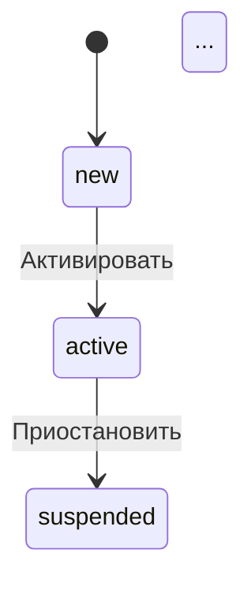

# Диаграммы состояний моделей AASM

Этот каталог содержит автоматически сгенерированные диаграммы состояний для всех моделей проекта Octoshell, использующих гем [AASM](https://github.com/aasm/aasm) (Acts As State Machine). Диаграммы представлены в двух форматах: **Graphviz DOT** и **Mermaid**, что позволяет редактировать их вручную и визуализировать с помощью различных инструментов.

## Назначение

Диаграммы помогают:
- Понимать логику переходов между состояниями в моделях.
- Документировать бизнес-процессы.
- Обсуждать изменения в state‑машинах с командой.
- Генерировать изображения для презентаций и документации.

## Генерация диаграмм

Для генерации диаграмм используется Rake‑задача `aasm:diagrams`. Запустите её в корне проекта:

```bash
bundle exec rake aasm:diagrams
```

Задача:
1. Загружает все модели Rails (включая модели из engines).
2. Находит классы, включающие модуль `AASM`.
3. Для каждой state‑машины извлекает состояния, события и переходы.
4. Получает русские переводы имён состояний и событий через модуль `AASM_Additions` (если перевод отсутствует, используется оригинальное имя).
5. Создает два файла для каждой state‑машины:
   - `<model>_<state_machine_key>.dot` – Graphviz DOT‑формат.
   - `<model>_<state_machine_key>.mmd` – Mermaid‑формат (stateDiagram‑v2).
6. Обновляет индексный файл `index.md` со списком всех диаграмм.

Файлы сохраняются в каталог `docs/state_machines/`.

## Опции командной строки

Задача поддерживает переменные окружения для фильтрации и настройки вывода:

| Переменная | Описание | Пример |
|------------|----------|--------|
| `ONLY`     | Фильтр по имени модели (регистронезависимый). Может содержать несколько значений через запятую. | `ONLY=Core::Project,Core::Member` |
| `FORMAT`   | Формат вывода: `dot`, `mermaid` или `both` (по умолчанию). | `FORMAT=dot` |
| `LOCALE`   | Локаль для переводов (по умолчанию `:ru`). | `LOCALE=en` |
| `OUTPUT_DIR` | Каталог для сохранения файлов (по умолчанию `docs/state_machines`). | `OUTPUT_DIR=tmp/diagrams` |

Примеры:

```bash
# Только для моделей Core::Project и Core::Member, только DOT
ONLY="Core::Project,Core::Member" FORMAT=dot bundle exec rake aasm:diagrams

# Все модели, только Mermaid
FORMAT=mermaid bundle exec rake aasm:diagrams

# С английскими переводами
LOCALE=en bundle exec rake aasm:diagrams
```

## Форматы файлов

### Graphviz DOT

Файлы с расширением `.dot` содержат описание графа в формате [Graphviz DOT](https://graphviz.org/doc/info/lang.html). Они предназначены для визуализации с помощью утилит Graphviz, а также для ручного редактирования расположения узлов.

#### Визуализация DOT-файлов

**1. Установка Graphviz**

На Ubuntu/Debian:
```bash
sudo apt-get install graphviz
```

На macOS (с Homebrew):
```bash
brew install graphviz
```

На Windows: скачайте установщик с [официального сайта](https://graphviz.org/download/).

**2. Генерация изображений**

Основная утилита `dot` преобразует `.dot` файл в растровое или векторное изображение:

```bash
# PNG
dot -Tpng путь/к/файлу.dot -o диаграмма.png

# SVG (рекомендуется для масштабирования)
dot -Tsvg путь/к/файлу.dot -o диаграмма.svg

# PDF
dot -Tpdf путь/к/файлу.dot -o диаграмма.pdf
```

**Пример с реальным файлом из проекта:**
```bash
dot -Tpng docs/state_machines/dot/ru/core/state_Проект.dot -o проект.png
```

**3. Онлайн-инструменты**

Если Graphviz не установлен, можно использовать онлайн-редакторы:
- [Graphviz Online](https://dreampuf.github.io/GraphvizOnline/) – простой редактор с предпросмотром
- [edotor.net](https://edotor.net/) – более продвинутый редактор с поддержкой позиционирования
- [Mermaid Live Editor](https://mermaid.live/) также поддерживает импорт DOT (ограниченно)

**4. Структура директорий**

Сгенерированные DOT-файлы организованы по локалям и модулям:
```
docs/state_machines/dot/
├── ru/                    # Русские переводы
│   ├── core/             # Модели из engine core
│   ├── sessions/         # Модели из engine sessions
│   └── ...
├── en/                   # Английские переводы
│   ├── core/
│   └── ...
└── ...
```

Имена файлов имеют формат `<state_machine_key>_<human_name>.dot`, где `human_name` – локализованное имя модели (может содержать кириллицу).

**5. Редактирование расположения узлов**

По умолчанию Graphviz автоматически расставляет узлы. Чтобы задать фиксированные позиции, добавьте атрибут `pos` в определение узла:

```dot
"active" [label="Активный", shape=ellipse, pos="100,200!"];
```

Суффикс `!` фиксирует позицию. После ручной расстановки всех узлов используйте `neato` с флагом `-n2` для рендеринга с сохранением позиций:

```bash
neato -Tpng -n2 файл.dot -o файл.png
```

**6. Пакетная обработка**

Для генерации изображений всех диаграмм можно использовать скрипт:

```bash
find docs/state_machines/dot -name "*.dot" -exec sh -c 'dot -Tpng "$1" -o "${1%.dot}.png"' _ {} \;
```

**7. Интеграция с документацией**

Сгенерированные PNG/SVG можно вставить в Markdown-документацию:

```markdown

```

#### Особенности генерации

- Узлы (состояния) имеют русские подписи (или подписи на выбранной локали).
- Переходы (события) также отображаются на русском.
- Начальное состояние помечено двойным кругом (`[*]`).
- Для удобства редактирования позиции узлов не заданы (можно добавить атрибут `pos` вручную).

### Mermaid

Файлы с расширением `.mmd` используют синтаксис [Mermaid stateDiagram‑v2](https://mermaid.js.org/syntax/stateDiagram.html). Их можно визуализировать:
- В [Mermaid Live Editor](https://mermaid.live/)
- В VS Code с расширением Mermaid Preview
- Встроить в Markdown‑документы (GitHub, GitLab, etc.)

**Пример содержимого:**


**Преимущества Mermaid:**
- Текстовый формат, удобный для версионного контроля.
- Поддержка интерактивности в некоторых инструментах.
- Простота редактирования.

## Переводы состояний и событий

Переводы извлекаются из YAML‑файлов локалей по пути:
```
activerecord.aasm.<model>.<state_key>.states.<state_name>
activerecord.aasm.<model>.<state_key>.events.<event_name>
```

Например, для модели `Core::Project` с ключом `:state` перевод состояния `active` ищется в:
```yaml
ru:
  activerecord:
    aasm:
      core/project:
        state:
          states:
            active: "Активный"
          events:
            activate: "Активировать"
```

Если перевод отсутствует (возвращается строка "Translation missing"), используется оригинальное имя состояния/события.

## Ручное редактирование диаграмм

Оба формата предназначены для последующего редактирования. Вы можете:
1. Изменить расположение узлов в DOT‑файле, добавив атрибут `pos`.
2. Переименовать подписи, если переводы неточны.
3. Добавить комментарии или стили.
4. Удалить лишние переходы (если они устарели).

После редактирования повторный запуск `rake aasm:diagrams` перезапишет файлы, поэтому рекомендуется сохранять изменённые версии под другим именем или использовать систему контроля версий.

## Интеграция с документацией

Индексный файл `index.md` содержит ссылки на все диаграммы. Его можно встроить в общую документацию проекта.

Для автоматического обновления диаграмм при изменении моделей можно добавить задачу в CI/CD пайплайн или pre‑commit hook.

## Устранение проблем

### Не найдены переводы
Убедитесь, что в файлах локалей (`config/locales/ru.yml`, `engines/*/config/locales/ru.yml`) присутствуют соответствующие ключи. Если переводы не нужны, можно отключить их, установив `LOCALE=nil` (используются оригинальные имена).

### Модели из engines не обнаруживаются
Задача использует `Rails.application.eager_load!`, который загружает все классы, включая engine‑модели. Если модель не появилась в списке, проверьте, что она включает `AASM` и что файл модели загружается при eager load.

### Ошибки генерации
Если возникает ошибка (например, отсутствует метод `human_state_name`), убедитесь, что модуль `AASM_Additions` подключён к модели. Обычно это делается через `include AASM_Additions` в классе модели или в `ApplicationRecord`.

## Дополнительные задачи

- `aasm:list` – выводит список всех моделей с AASM и их state‑машины (без генерации файлов).
- `aasm:images` – генерирует PNG/SVG/PDF изображения из DOT‑файлов (требует установленного Graphviz).
- `aasm:diagrams:clean` – удаляет все сгенерированные файлы в `docs/state_machines/` (опционально).

### Генерация изображений (`aasm:images`)

Задача `aasm:images` конвертирует все DOT‑файлы в растровые или векторные изображения с помощью утилиты `dot`. Используйте её после генерации диаграмм (`aasm:diagrams`).

**Опции (через переменные окружения):**

| Переменная | Описание | Пример |
|------------|----------|--------|
| `FORMAT`   | Форматы изображений через запятую: `png`, `svg`, `pdf` (по умолчанию `png`). | `FORMAT=png,svg` |
| `LOCALE`   | Фильтр по локалям (например, только русские диаграммы). | `LOCALE=ru` |
| `OVERWRITE` | Перезаписать существующие изображения (`true`/`false`, по умолчанию `false`). | `OVERWRITE=true` |
| `OUTPUT_DIR` | Каталог для сохранения изображений (по умолчанию `docs/state_machines/images`). | `OUTPUT_DIR=tmp/images` |

**Примеры:**

```bash
# Сгенерировать PNG для всех DOT‑файлов
bundle exec rake aasm:images

# Сгенерировать SVG и PNG только для русской локали
FORMAT=svg,png LOCALE=ru bundle exec rake aasm:images

# Перезаписать существующие PNG
OVERWRITE=true bundle exec rake aasm:images
```

Изображения сохраняются в структуре, аналогичной DOT‑файлам:
```
docs/state_machines/images/
├── ru/
│   ├── core/
│   │   ├── state_Проект.png
│   │   └── ...
│   └── ...
└── en/
    └── ...
```

Если утилита `dot` не установлена, задача выведет сообщение об ошибке с инструкцией по установке Graphviz.

## Лицензия

Диаграммы созданы автоматически и являются частью проекта Octoshell. Используйте их в соответствии с лицензией проекта.