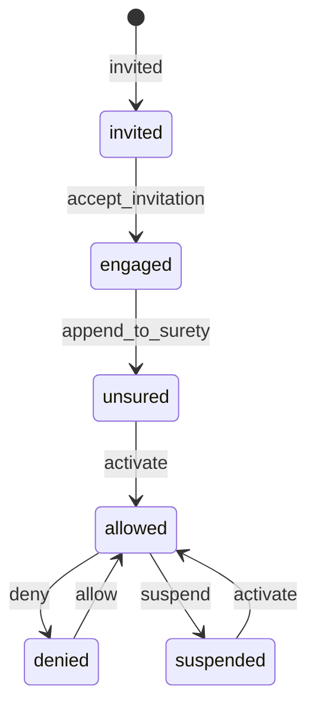
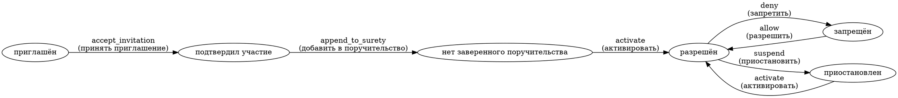

# План генерации диаграмм состояний AASM

## Цель
Создать Rake-задачу, которая находит все модели с использованием гема `aasm` в проекте (включая engines) и генерирует для них диаграммы состояний с русскими обозначениями, используя кастомный механизм переводов из `lib/aasm_additions.rb`. Диаграммы должны быть редактируемыми (текстовые файлы в форматах Mermaid и Graphviz DOT).

## Обзор
Проект Octoshell использует AASM для управления состояниями в различных моделях. Переводы состояний и событий хранятся в YAML-файлах локалей по пути `activerecord.aasm.<model>.<state_key>`. Для получения переводов используется модуль `AASM_Additions`, который добавляет методы `human_state_name` и `human_state_event_name`.

## Шаги реализации

### 1. Создание Rake-задачи
- Файл: `lib/tasks/aasm_diagrams.rake`
- Задача: `rake aasm:diagrams` (основная) и `rake aasm:diagrams:list` (список моделей)
- Задача должна загружать Rails-окружение для доступа к моделям и переводам.

### 2. Поиск моделей с AASM
- Рекурсивно сканировать директории `app/models` и `engines/*/app/models` на наличие файлов `.rb`.
- Для каждого файла проверить, содержит ли он `include AASM` (или `include ::AASM`).
- Включить декораторы (например, `user_decorator.rb`), так как они также содержат AASM.
- Загрузить класс модели с помощью `safe_constantize`.
- Убедиться, что класс включает `AASM_Additions` (опционально).

### 3. Извлечение информации о state machine
- Для каждой модели получить ключи state machine через `AASM::StateMachineStore[name].keys`.
- Для каждого ключа (обычно один) получить объект state machine: `model.aasm(<key>)`.
- Извлечь:
  - **Состояния**: `state_machine.states` (массив объектов `AASM::State`), включая initial состояние.
  - **События**: `state_machine.events` (массив объектов `AASM::Event`).
  - **Переходы**: для каждого события получить `event.transitions` (массив хэшей с `:from` и `:to`).
- Учесть, что `from` может быть массивом состояний.

### 4. Получение русских переводов
- Использовать методы из `AASM_Additions`:
  - `model.human_state_name(state)` для перевода состояния.
  - `model.human_state_event_name(event)` для перевода события.
- Если метод недоступен, fallback на оригинальное имя (английское).
- Убедиться, что переводы загружены (I18n.locale = :ru).

### 5. Генерация диаграмм
#### Формат Mermaid (stateDiagram-v2)
- Создать текстовый файл с расширением `.mmd`.
- Синтаксис:
  ```
  stateDiagram-v2
    [*] --> invited
    invited --> engaged: accept_invitation
    ...
  ```
- Использовать русские labels для состояний и событий в формате: `событие : русское_событие`.
- Начальное состояние обозначить `[*] --> <initial_state>`.
- Можно добавить комментарии с оригинальными именами.

#### Формат Graphviz DOT
- Создать файл с расширением `.dot`.
- Синтаксис digraph:
  ```
  digraph {
    rankdir=LR;
    node [shape=oval];
    invited [label="приглашён"];
    engaged [label="подтвердил участие"];
    invited -> engaged [label="accept_invitation\n(принять приглашение)"];
  }
  ```
- Для лучшей читаемости можно использовать HTML-подписи.
- Позволяет задавать позиции узлов (атрибут `pos`), что удобно для последующего редактирования.

### 6. Сохранение файлов
- Директория вывода: `docs/state_machines/`
- Именование файлов: `<engine>_<model>_<state_machine>.<format>`
  - Пример: `core_member_project_access_state.dot`
  - Если engine отсутствует (модель в основном приложении), использовать `main`.
- Создать индексный файл `index.md` со списком всех диаграмм и ссылками.

### 7. Редактируемость
- Файлы `.mmd` и `.dot` являются текстовыми, их можно редактировать в любом редакторе.
- Пользователь может менять позиции узлов в DOT-файле (добавлять атрибуты `pos`).
- При повторном запуске задачи существующие файлы будут перезаписаны (можно добавить опцию `--force`).

### 8. Дополнительные возможности
- Опция `--only=<model>` для генерации диаграммы только для указанной модели.
- Опция `--format=<mermaid|dot|both>` для выбора формата.
- Опция `--locale=<ru|en>` для выбора языка переводов.
- Логирование процесса в консоль.

### 9. Тестирование
- Протестировать на нескольких моделях: `Core::Member`, `Core::Project`, `Sessions::Report`.
- Проверить корректность извлечения состояний и событий.
- Убедиться, что переводы на русский присутствуют.
- Визуально проверить сгенерированные диаграммы (можно использовать Mermaid Live Editor или Graphviz).

### 10. Документация
- Добавить комментарии в код Rake-задачи.
- Создать README в директории `docs/state_machines/` с инструкциями по использованию и редактированию.
- Указать, как преобразовать DOT в изображение (команда `dot -Tpng file.dot -o file.png`).

## Пример вывода для Core::Member
### Mermaid


### Graphviz DOT


## Риски и ограничения
- Модели с несколькими state machines (разные колонки) могут быть обработаны некорректно, если `AASM_Additions` не поддерживает их. Нужно генерировать отдельную диаграмму для каждой машины.
- Некоторые модели могут быть не загружены из-за зависимостей (например, отсутствующие engine). Обрабатывать ошибки загрузки.
- Переводы могут отсутствовать для некоторых состояний/событий. Использовать fallback.

## Следующие шаги
1. Утвердить план.
2. Переключиться в режим Code для реализации.
3. Протестировать и доработать.
4. Интегрировать в проект.

## Вопросы для уточнения
- Нужно ли также генерировать изображения (PNG/SVG) автоматически?
- Хотите ли вы включить в диаграмму дополнительные метаданные (например, guards, callbacks)?
- Следует ли игнорировать определенные модели (например, декораторы)?